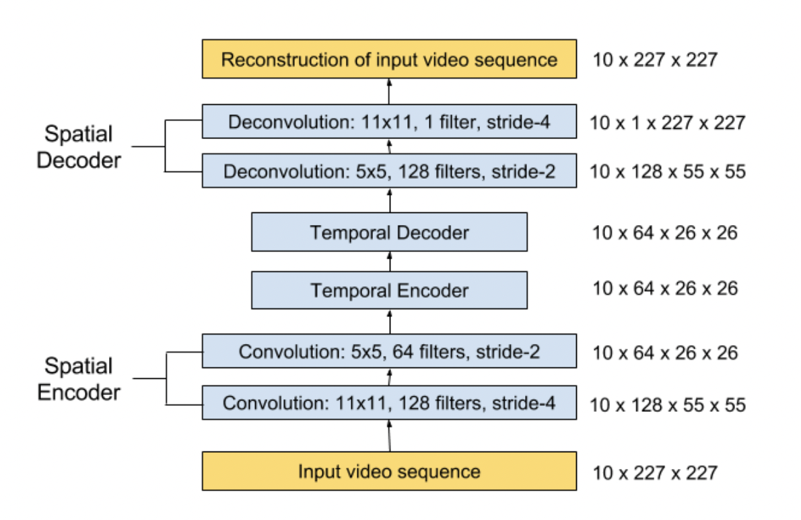

# Abnormal-Event-Recognition
Abnormal Event Detection in Videos using Spatiotemporal Autoencoder

## Abstract
In this project we present an efficient method for detecting anomalies in videos based on the reseach paper tiltled the same(look in the references). Recent applications of convolutional neural networks have shown promises of convolutional layers for object detection and recognition, especially in images. However, convolutional neural networks are supervised and require labels as learning signals.Moreover, Video data is challenging to represent and model due to its high dimensionality, noise, and a huge variety of events and interactions. Anomalies are also highly contextual. We therefore propose a spatiotemporal architecture for anomaly detection in videos including crowded scenes. Our architecture includes two main components, one for spatial feature representation, and one for learning the temporal evolution of the spatial features.Specifically we present a deep neural network composed of a stack of convolutional autoencoders was used to process video frames in an unsupervised manner that captured spatial structures in the data, which, grouped together, compose the video representation. Then, this representation is fed into a stack of convolutional temporal autoencoders to learn the regular temporal patterns.

## Language: 

Python 3.8

## Libraries and Modules: 
- Pandas
- Numpy 
- Scipy 
- argparse 
- csv, re, cv2 
- os, glob, io 
- tensorflow
- PIL
- shutil, urllib, files(google colab)

## Dataset: 
Avenue Dataset for Abnormal Detection

## Model Architechture:

Our proposed architecture consists of two parts:
 
 **Spatial autoencoder** for learning spatial structures of each video frame
 **Temporal encoder-decoder** for learning temporal patterns of the encoded spatial structures. 

As illustrated in Figure 1 and 2, the spatial encoder and decoder have two convolutional and deconvolutional layers respectively, while the temporal encoder is a three-layer convolutional long short term memory (LSTM) model. Convolutional layers are well-known for its superb performance in object recognition, while LSTM model is widely used for sequence learning and time-series modelling.

**Figure 1:** *Our proposed network architecture. It takes a sequence of length T as input, and output a reconstruction of the input sequence. The numbers at the rightmost denote the output size of each layer. The spatial encoder takes one frame at a time as input, after which T = 10 frames have been processed, the encoded features of 10 frames are concatenated and fed into temporal encoder for motion encoding. The decoders mirror the encoders to reconstruct the video volume.*

 
**Figure 2:** *The zoomed-in architecture at time t, where t is the input vector at this time step. The temporal encoder-decoder model has 3 convolutional LSTM (ConvLSTM) layers*

## Regularity Score:

Once the model is trained, we can evaluate our models performance by feeding in testing data and check whether it is capable of detecting abnormal events while keeping false alarm rate low. To better compare with, we used the same formula to calculate the regularity score for all frames, the only difference being the learned model is of a different kind. The reconstruction error of all pixel values I in frame t of the video sequence is taken as the Euclidean distance between the input frame and the reconstructed frame.

## Step 1: Data Pre-Processing

1. Download the videos files, divide it by frames and save the images in .jpg format in the /img directory.
2. Use Argprase parser to add argument to the file names.
3. Divide each and every video into frames and save the frames in a directory separated by the type of anomaly or situation as well as resize the images to    scale.
4. Reshape and normalize the images.

## Step 2: Ceating the Spatial encoder model using ConvNets:

1. Import the Convolutional 3D, Convolutional LSTM 2D ,Convolutional 3D Transpose models from the keras libaray and create a linearly mapped sequential model for encoding.
2. Complilation parameters:
  * Let the optimizer be Adam and metric loss be Categorical Crossentropy.
  * Activation function for hidden layers: ReLU
  * Output layer activation function: Sigmoid.

## Step 3: Training the Model

1. This model was then trained on the Avenue dataset for 32 epochs by running python train_model.py
2. If the kernel dies, the training will resume from the last checkpoint.
3. Use of early Callbacks to stop the training if it goes out of hand.

## Step 4: Export the Trained Model
1. the model will save a checkpoint every 600 seconds while training up to 5 checkpoints. Then, as new files are created, older files are deleted.
2. A file called model.h5 is created which will be used while testing later.

## Step 5: Testing the Detector
1. Load the model.h5 file.
2. Test the Videos.

**References**

1. https://towardsdatascience.com/auto-encoder-what-is-it-and-what-is-it-used-for-part-1-3e5c6f017726#:~:text=Autoencoder%20is%20an%20unsupervised%20artificial,the%20original%20input%20as%20possible.
2. https://github.com/aninair1905/Abnormal-Event-Detection
3. https://arxiv.org/pdf/1701.01546.pdf
